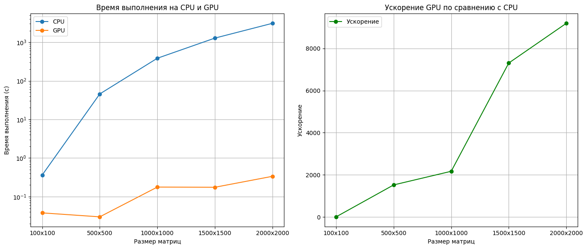

# Перемножение матриц

- Задача: реализовать алгоритм перемножения матриц
- Язык: Python
- Входные данные: 2 матрицы размером от 100х100 до 2000х2000 каждая.

## Таблица времени работы на CPU и GPU
В таблице представлены 

| Размер матриц |  Время CPU  | Время GPU |  Ускорение  |
|---------------|-------------|-----------|-------------|
| 100x100       | 0.363988    | 0.038000  | 9.578596    |
| 500x500       | 45.705386   | 0.030001  | 1523.465895 |
| 1000x1000     | 384.145895  | 0.177001  | 2170.297687 |
| 1500x1500     | 1278.220166 | 0.175000  | 7304.107272 |
| 2000x2000     | 3086.937718 | 0.336004  | 9187.217789 |

### Описание
- **Размер матриц**: Размеры матриц.
- **Время CPU**: Время выполнения операции на CPU.
- **Время GPU**: Время выполнения операции на GPU.
- **Ускорение**: Ускорение (отношение времени на CPU к времени на GPU).

## Графики

##
Замеры произоводились на следующей системе:
- **CPU:** AMD Ryzen 5 5600X @ 3.70GHz
- **GPU:** Nvidia GeForce®RTX 4060 Ti 8gb
- **RAM:** 16gb, 3600MHz
