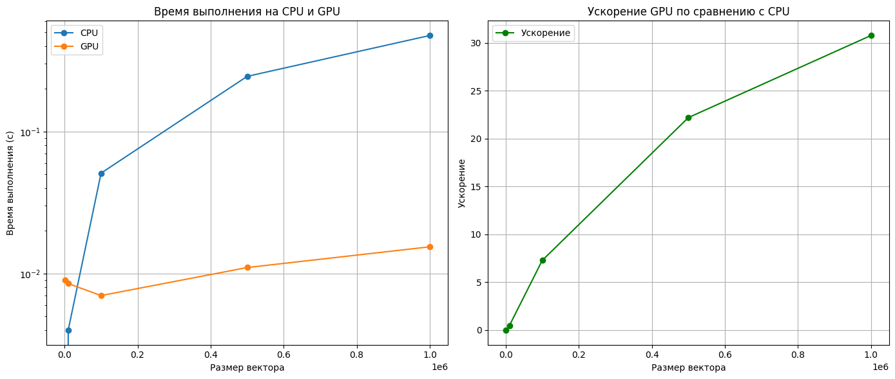

# Сложение вектора

- Задача: реализовать алгоритм сложения элементов вектора
- Язык: Python
- Входные данные: вектор размером 1 000..1 000 000 значений.

## Таблица времени работы на CPU и GPU
В таблице представлены 

| Размер вектора |  Время CPU  | Время GPU |  Ускорение  |
|----------------|-------------|-----------|-------------|
| 1000           | 0.000000    | 0.008999  | 0.000000    |
| 10000          | 0.004004    | 0.008505  | 0.470761    |
| 100000         | 0.050997    | 0.007003  | 7.282164    |
| 500000         | 0.244831    | 0.011031  | 22.194039   |
| 1000000        | 0.475004    | 0.015437  | 30.769757   |

### Описание
- **Размер матриц**: Размеры векторов.
- **Время CPU**: Время выполнения операции на CPU.
- **Время GPU**: Время выполнения операции на GPU.
- **Ускорение**: Ускорение (отношение времени на CPU к времени на GPU).

## Графики

##
Замеры произоводились на следующей системе:
- **CPU:** AMD Ryzen 5 5600X @ 3.70GHz
- **GPU:** Nvidia GeForce®RTX 4060 Ti 8gb
- **RAM:** 16gb, 3600MHz
